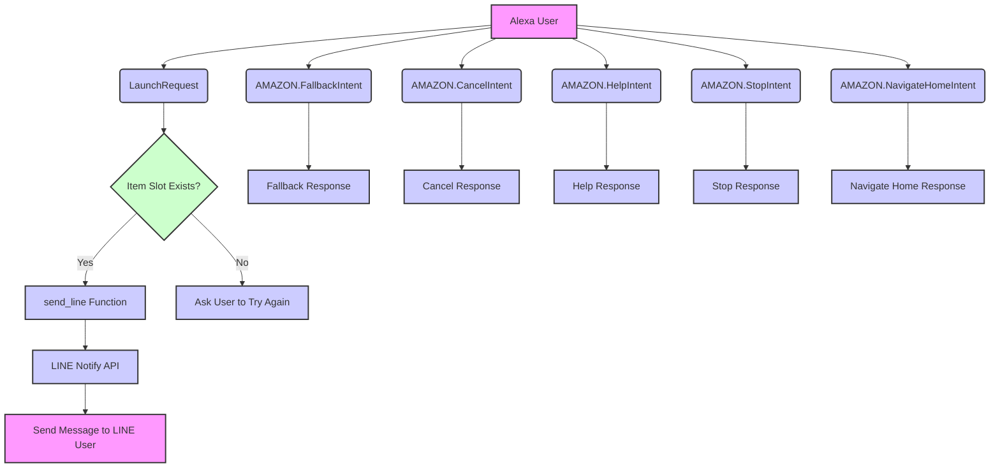

# 買い物メモ (Shopping Memo) - Alexa Skill

買い物メモ (Shopping Memo) is an Alexa Skill that allows users to send shopping items to their LINE account using LINE Notify API. This skill serves as a learning example for those who want to understand how to build an Alexa Skill using Python and the ASK SDK, as well as how to integrate it with the LINE Notify API.

# Table of Contents

- [Features](#features)
- [Getting Started](#getting-started)
  - [Prerequisites](#prerequisites)
  - [Installation](#installation)
- [Usage](#usage)
- [Project Structure](#project-structure)
- [Flowchart](#flowchart)
- [License](#license)

# Features

- Add shopping items to your LINE account
- Simple, easy-to-understand code for learning purposes
- Integration with LINE Notify API
- Example of how to use the ASK SDK for Python

# Flowchart




# lambda function

`lambda_function.py` code defines the behavior of your Alexa skill using the ASK SDK. Here's a step-by-step explanation of what happens in the code:

1. Import the necessary libraries, including `logging`, `requests`, and the Alexa Skills Kit (ASK) SDK.

2. Create a `SkillBuilder` instance (`sb`). This instance helps you manage request handlers and exception handlers.

3. Set up a logger for logging information about your Lambda function's execution.

4. Define the `send_line` function, which takes a text input, and sends it as a message to your LINE Notify API using your LINE API token. This function sends an HTTP POST request to the LINE Notify API with the necessary headers and data.

5. Create a request handler for the `LaunchRequest` event. When a user opens your Alexa skill without providing any specific intent, the `launch_request_handler` function is called. It sets the initial speech output to "何を買いますか" (What would you like to buy?) and returns the response.

6. Create a request handler for your custom intent, `MyShoppingMemoIntent`. When a user interacts with your skill using one of the sample utterances you defined, the `my_shopping_memo_handler` function is called. The function checks if the "Item" slot is present in the user's request. If the item is present, it sends the item to the LINE Notify API using the `send_line` function, and sets the speech output to acknowledge the action. If the item is not present, it sets the speech output to ask the user to try again.

7. Create an exception handler that catches any exceptions that occur during your skill's execution. If an exception is caught, the `all_exception_handler` function sets the speech output to inform the user that there was a problem and asks them to try again.

8. Finally, create a Lambda handler (`lambda_handler`) by calling `sb.lambda_handler()`. This handler is used by AWS Lambda to invoke your skill.


```

# Interaction Model
`ja-JP.json` file defines the interaction model for your Alexa skill in Japanese. The interaction model contains the following elements:

- `invocationName`: The name users say to invoke your skill. In this case, it's "買い物メモ" (shopping memo).

- `intents`: A list of intents for your skill. Intents represent the actions that users can perform with your skill. This list includes built-in Amazon intents like `AMAZON.FallbackIntent`, `AMAZON.CancelIntent`, `AMAZON.HelpIntent`, `AMAZON.StopIntent`, and `AMAZON.NavigateHomeIntent`, as well as your custom intent, `MyShoppingMemoIntent`.

  - `MyShoppingMemoIntent`: The custom intent you created for your skill. This intent has one slot, `Item`, which represents the item users want to add to their shopping list. The type of the slot is `AMAZON.Actor`. The intent also contains sample utterances, which are example phrases users might say to interact with your skill:

    - "{Item}": A simple phrase where users just say the item they want to add.
    - "I want to buy {Item}": A phrase where users specify their intent to buy an item.
    - "Add {Item} to my shopping list": A phrase where users explicitly ask to add an item to their shopping list.
    - "I need to buy {Item}": A phrase where users express a need to buy an item.
    - "Please remember to buy {Item}": A phrase where users ask Alexa to remember to buy an item.

- `types`: A list of custom slot types for your skill. In this case, you don't have any custom slot types, so the list is empty.

- `version`: The version number of your interaction model. In this case, it's "25".

# Installation

1. Clone the repository:

   ``
   git clone https://github.com/yourusername/shopping-memo.git
   ``

2. Install dependencies by uploading files to alexa skill developer console.
3. Deploy and build your code to the Lambda function.
4. Enable the skill on your Alexa-enabled device and test it.

# Usage

To use the skill, invoke it on your Alexa-enabled device by saying "アレクサ、買い物メモを開いて" (Open Shopping Memo). Then, you can add items to your LINE account by saying the item's name.

# Project Structure

The project consists of the following main components:

- `lambda/lambda_function.py`: The main Lambda function containing the skill's logic and handlers.
- `lambda/requirements.txt`: A list of Python dependencies for the Lambda function.
- `interactionModels/custom/ja-JP.json`: The interaction model for the skill in Japanese.


# License

This project is licensed under the MIT License. See the [LICENSE](LICENSE) file for details.
